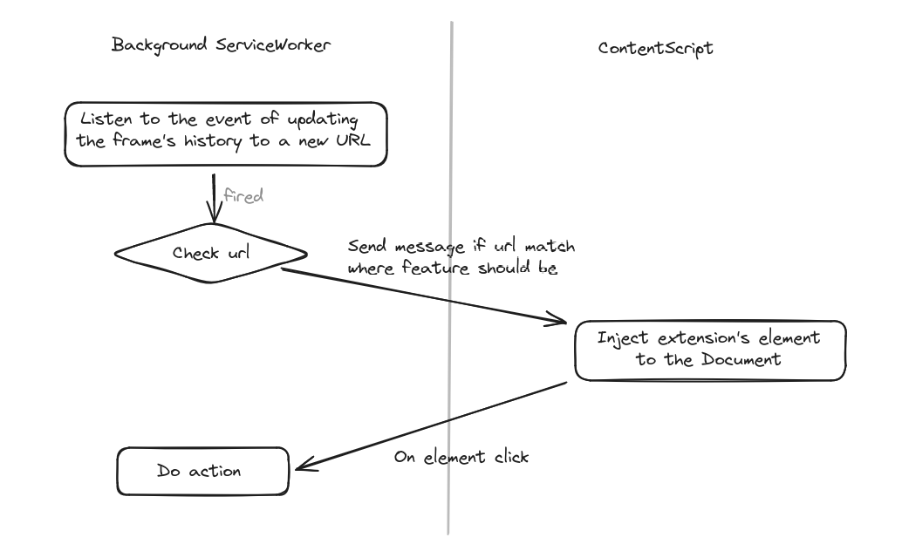

# GitHub Extensions

## Getting Started

### Available Development Scripts

#### `npm install`
Install all the project's required dependencies.

#### `build_chrome_manifest.sh`
Generate manifest file for chrome extensions (`manifest.json`).
_(Make sure the script has executable permissions.)_

#### `npm run build-dev`
Compile and bundle TypeScript source code into a development JavaScript format using the configuration in 'webpack.config.js'.

#### `npm start`
Continuously monitor TypeScript source code changes, by recompiling and updating the output as needed, based on the 'webpack.config.js' settings.


### Diagram

The following diagram provides an overview of how different components interact and the sequence of operations in the overall process.




## Contributing
See [the contributing guide](CONTRIBUTING.md) for detailed instructions on how to get started with our project. 


## License
```
    Apache 2.0 License


    Copyright 2023 - Drioueche Mohammed

    Licensed under the Apache License, Version 2.0 (the "License");
    you may not use this file except in compliance with the License.
    You may obtain a copy of the License at

       http://www.apache.org/licenses/LICENSE-2.0

    Unless required by applicable law or agreed to in writing, software
    distributed under the License is distributed on an "AS IS" BASIS,
    WITHOUT WARRANTIES OR CONDITIONS OF ANY KIND, either express or implied.
    See the License for the specific language governing permissions and
    limitations under the License.

```
